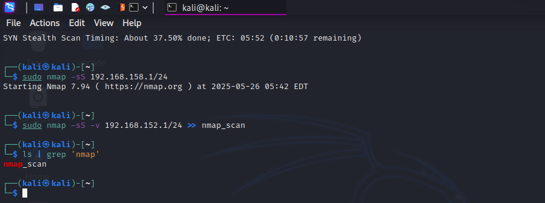

1. Get Your Local IP Address

   Using ifconfig or ip:

   On Linux:	

   ```bash
   ifconfig | grep inet
   # OR
   ip a | grep inet
   ```
2. Nmap Scan Guide

## Nmap Command Used


## Results Summary
- Most IPs were marked as "host down" or had all ports filtered.
- Three hosts were detected as up:
  - `192.168.152.1` – All 1000 ports filtered.
  - `192.168.152.254` – All 1000 ports filtered.
  - `192.168.152.128` – Port **8009/tcp (ajp13)** open.

## Observations
- Only one host with an open port (potential target for further security analysis).
- Virtual machine MAC addresses suggest internal VM activity.
