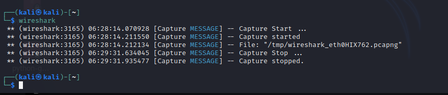
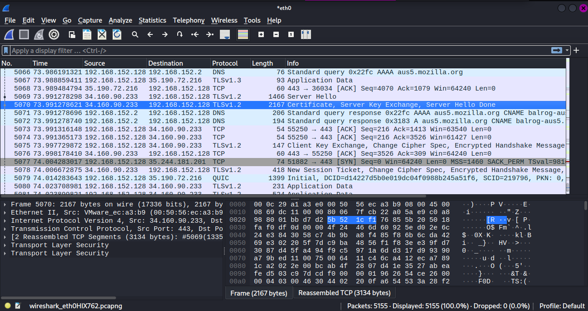
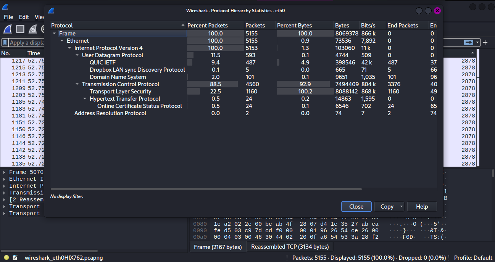

# Wireshark Protocol Analysis
1. Running 'Wireshark' from CLI
   
   
2. Capturing packets using Wireshark
   

3. Wireshark Protocol Hierarchy
   
Based on the packet capture from interface `eth0`, here is the protocol distribution:

- **Total Packets:** 5155
- **Top Protocols by Packet Count:**
  - Transmission Control Protocol (TCP): 88.5%
  - Transport Layer Security (TLS): 22.5%
  - QUIC, DNS, HTTP, ARP: Minor traces
